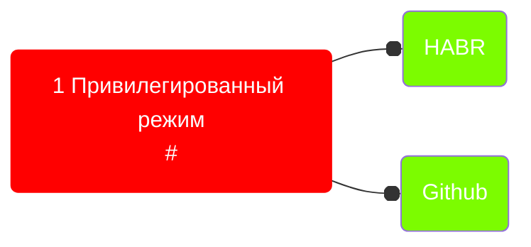

```mermaid 
graph LR
classDef class1 fill:#FF0000,stroke:#FF0000,color:#fbfdfe
classDef class2 fill:#7CFC00,color:#FFFFFF

A(1 Привилегированный режим<br>#):::class1 --o B(HABR):::class2
click B "https://habr.com/ru/all/" _blank

A --o C(Github <br>):::class2


```
