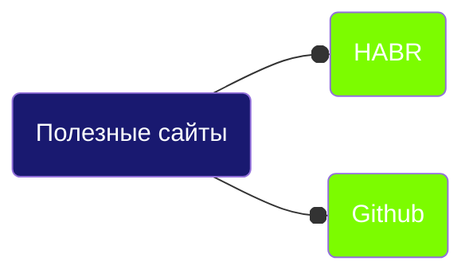

```mermaid 
graph LR
classDef class1 fill:#191970, color:#fbfdfe
classDef class2 fill:#7CFC00,color:#FFFFFF

A(Полезные сайты<br>):::class1 --o B(HABR):::class2
click B "https://habr.com/ru/all/" _blank

A --o C(Github<br>):::class2
click C "https://github.com/" _blank


```
