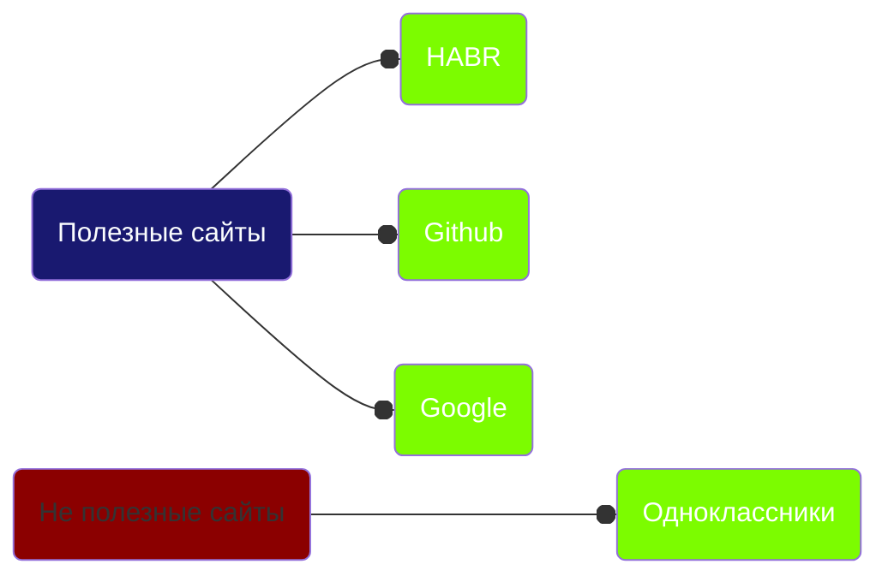

```mermaid 
graph LR
classDef class1 fill:#191970, color:#fbfdfe
classDef class2 fill:#7CFC00,color:#FFFFFF
classDef class3 fill:#8B0000, color:FFFFFF

A(Полезные сайты<br>):::class1 --o B(HABR<br>):::class2
click B "https://habr.com/ru/all/" _blank

A --o C(Github<br>):::class2
click C "https://github.com/" _blank

A --o D(Google<br>):::class2
click D "https://www.google.com/webhp?hl=ru&sa=X&ved=0ahUKEwisq9KR38n9AhUQposKHUIPAPgQPAgI" _blank

E(Не полезные сайты<br>):::class3 ---o F(Одноклассники<br>):::class2
click F "https://ok.ru/"


```
